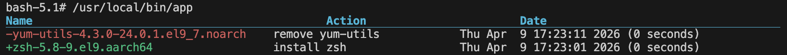

# pkgdiff

## Intro

Get a list of installed packages on your RHEL based VM, and get a separate list of packages that have been removed or installed from the VM. Output the changes list... It's very simplistic right now, but has decent potential for expansion, to make a manifest file.

## Quick Start

 * docker build -t myapp:dev .
 * If you already ran this before, delete previous app:
    * docker rm myapp-dev --force
 * docker run -d --name myapp-dev myapp:dev
 * docker exec -it myapp-dev bash
    * /usr/local/bin/app
    * dnf install zsh
    * dnf remove yum-utils
    * /usr/local/bin/app

## Output

## TODO

(In order of importance, in my opinion)

1. Incoporate rpm database info similar to how dnf already done  
2. Put this information into an HTML report page with git diff style rendering, but for packages instead of code lines
3.  Retrieve package changes for upgrades and downgrades too, not just removals and adds
4.  Expand to more Linux flavors

